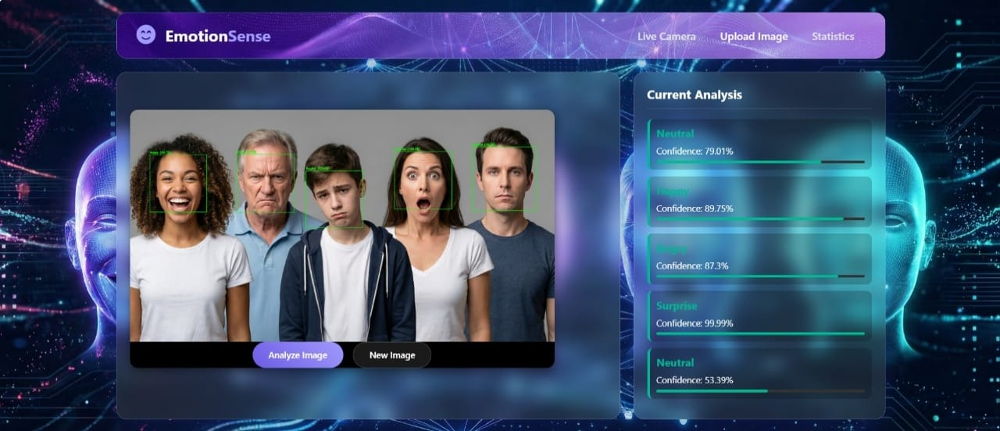
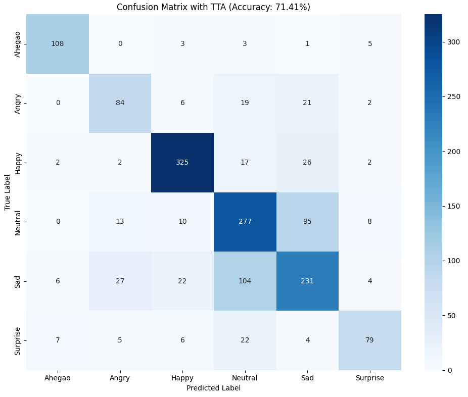

#  Facial Emotion Recognition System

> **An End-to-End Deep Learning Web Application for Real-Time Facial Emotion Detection.**
##  Project Demo


---
##  Overview
This project bridges the gap between **Deep Learning** and **Web Development**. It implements a robust Computer Vision pipeline capable of detecting and classifying human facial expressions into 6 distinct categories:
**Happy, Sad, Angry, Surprise, Neutral, and Ahegao.**

The system is powered by **EfficientNetB4** (Transfer Learning) and deployed via a lightweight **Flask** server with a responsive, glassmorphism-styled frontend.

##  Key Features
- ** Real-Time Inference:** Zero-latency emotion detection via Webcam using OpenCV.
- ** Image Analysis:** Upload capability for static image processing.
- ** Advanced Architecture:** Utilizes **EfficientNetB4** backbone with custom dense layers.
- ** Robust Performance:** Implements **Test Time Augmentation (TTA)** and **Class Weighting** to handle data imbalance.
- ** Analytics Dashboard:** Interactive Chart.js visualization for emotion distribution.

---

##  Tech Stack

| Domain | Technologies |
| :--- | :--- |
| **Deep Learning** | TensorFlow, Keras, EfficientNetB4 |
| **Computer Vision** | OpenCV (Haar Cascades), Pillow |
| **Data Processing** | Pandas, NumPy, Scikit-learn |
| **Backend** | Flask (Python), Jinja2 |
| **Frontend** | HTML5, CSS3 (Glassmorphism), Vanilla JS |
| **Visualization** | Matplotlib, Seaborn, Chart.js |

---

##  Model Architecture

The model uses **Transfer Learning** to leverage features learned from ImageNet, fine-tuned for facial features.


### Training Strategy:
1.  **Preprocessing:** Resizing (224x224), Normalization, and Label Encoding.
2.  **Backbone:** EfficientNetB4 (Pre-trained, top layers unfrozen).
3.  **Head:** GlobalAveragePooling -> Dense(1024) -> Dense(512) -> Output(6).
4.  **Regularization:** Dropout, BatchNormalization, and L2 Regularization.

---

##  Performance & Results

The model achieved a final accuracy of **71.41%** on the unseen test set using TTA.



### Per-Class Accuracy (with TTA):
| Class | Accuracy | Recall |
| :--- | :--- | :--- |
| **Ahegao** | 90.00% | High |
| **Happy** | 86.90% | High |
| **Neutral** | 68.73% | Medium |
| **Surprise**| 64.23% | Medium |
| **Angry** | 63.64% | Medium |
| **Sad** | 58.63% | Challenging |

---

##  Project Structure
```bash
Facial-Emotion-Recognition/
├── app.py                   # Flask Backend Entry Point
├── requirements.txt         # Project Dependencies
├── model/                   # Trained Model Files
│   └── efficientnet_model.h5
├── frontend/                # Web Interface Resources
│   ├── index.html           # Main UI
│   ├── css/style.css        # Styling
│   └── js/main.js           # Client-side Logic
└── notebooks/               # Research & Training Code
    └── Facial_Emotion_Recognition.ipynb
